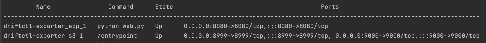
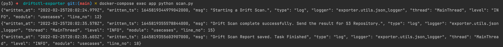
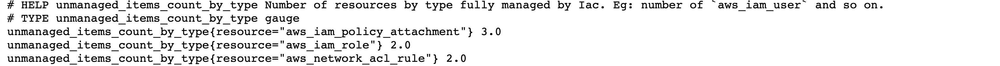
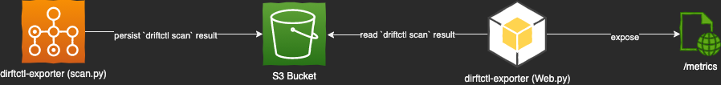

## Driftctl Exporter

This project aims export the driftctl scan result in the prometheus exporter/openmetrics format, making it suitable to monitoring possible drifts on a environment.

This project doesn't have a direct relation with [GitHub - snyk/driftctl: Detect, track and alert on infrastructure drift](https://github.com/snyk/driftctl), but it uses the scan feature and the result created to expose it as basic metrics and some other metrics (like counts by resource type).

#### Walkthrough - AWS Scenario

Starting with a local spin of the project in mind,  where you cloned the project and accessed the created directory, this scenario steps requires the following:

* **AWS User Credentials/keys**** capable to read all sort of resources on the target account. If unsure, check [AWS Iam Access Keys](https://docs.aws.amazon.com/IAM/latest/UserGuide/id_credentials_access-keys.html for more information) for more information;

* **Docker and docker-compose installed and working.**

Considering a scenario where you have an AWS account and credential, create a `.env` file in the root of the project with the following content (if unsure, check https://docs.aws.amazon.com/sdkref/latest/guide/environment-variables.html for more info):

```env
AWS_ACCESS_KEY_ID=<KEY HERE>
AWS_SECRET_ACCESS_KEY=<SECRET ACCESS KEY HERE>
AWS_SESSION_TOKEN=<IF YOURE USING SSO, YOU SHOULD PUT SOMETHING HERE>
AWS_REGION=<YOUR REGION>
```

And execute the command `docker-compose up -d`. After a few seconds, check the status of the containers using the `docker-compose ps` command:



With the those two containers started, you can now run the `scan.py` script by calling the command `docker-compose exec app python scan.py`; after a few seconds (or more depending on how how much resources the target aws account have), check for `"msg": "Drift Scan Report saved. Task Finished"` log in the output:



Now point your browser to `http://localhost:8080/metrics` to see what metrics has been generated. Eg:



Enjoy!

#### How to use it

Starting from the walkthrough example, update the `docker-compose.yaml`  values for  `DCTL_FROM` and `RESULT_PATH` environment variables as following:

|                          | Description                                                                                                                                                                                                                                                                                                                           | Required | Default |
| ------------------------ | ------------------------------------------------------------------------------------------------------------------------------------------------------------------------------------------------------------------------------------------------------------------------------------------------------------------------------------- | -------- | ------- |
| DCTL_FROM                | Where driftctl can find the tfstate. Normally something like `tfstate:///home/user/terraform.tfstate`. The [Driftcl with terragrunt](https://driftctl.com/how-to-use-driftctl-with-terragrunt/) blog post have awesome examples on how to consume a tfstate from a s3 or a set of tfstates from terragrunt and other useful examples. | Yes      | N/A     |
| RESULT_PATH              | S3 URL Location where the scan result will be persisted. Must be an S3 URL (RFC 1808). Eg: s3://my-bucket/result.json                                                                                                                                                                                                                 | **Yes**  | N/A     |
| AWS_S3_ENDPOINT_URL      | An optional endpoint for s3. Useful for those scenarios where you want to persist the scan results in a different region that scan ran or if you want to use non-aws s3 compatible implementations, like minio, ceph, digitalocean,etc. <br/>Eg: for local testing, I used "http://s3:9000" to point into the local minio.            | No*      | None    |
| AWS_S3_ACCESS_KEY_ID     | Access Key ID used to authenticate against the s3 endpoint configured. <br/>Required if you have configured the `AWS_S3_ENDPOINT_URL`                                                                                                                                                                                                 | No*      | None    |
| AWS_S3_SECRET_ACCESS_KEY | Secret ACCESS Key ID used to authenticate against the s3 endpoint configured.<br/>Required if you have configured the `AWS_S3_ENDPOINT_URL`                                                                                                                                                                                           | No*      | None    |

After changing the desired environment variables, run `docker-compose up -d` , `docker-compose exec app python scan.py` and check the results at `http://localhost:8080/metrics`.

> Actually, the walkthrough keep the scan results in a s3 minio service declared on docker-compose.yaml. You can change that behavior by just removing  `AWS_S3_ENDPOINT_URL`, `AWS_S3_ACCESS_KEY_ID` and `AWS_S3_SECRET_ACCESS_KEY` from the docker-compose.yam file.

#### How it Works?

Actually, the workflow consists in 3 steps:

1. The `scan.py` runs `drifctl scan` command, whom reads the tfstate configured by the `DCTL_FROM` environment variable, compare with the cloud resources and persist the scan result in json format to the s3 bucket specified in `RESULT_PATH` environment variable;

2. The `web.py` expose the `/metrics` endpoint which scrapes the scan result from s3 every time a get request is received;

3. Scrape the values using some compatible application (prometheus, opentelemetry, datadog agent, etc).

### Architecture - Components

The drifctl exporter consists in two main python scripts: **scan.py** and **web.py**, which compound the following workflow:



##### Scan.py

The **scan.py** script relies heavily on [GitHub - snyk/driftctl: Detect, track and alert on infrastructure drift](https://github.com/snyk/driftctl) to generate the drift result in json format.

As the `drifctl scan` can have some big execution times (depending on how many resources are you comparing), it is safe to assume the "batch" nature of the script; actually I think it should be executed some times in a day but not more often.

It executes the `driftctl scan` using the `DCTL_FROM` environment variable to read the `tfstate` file (or files) and compare the resources described in the tfstate with those created on the cloud; after that, it persist the `driftctl scan` json result in a s3 bucket specified by the `RESULT_PATH` environment variable.

##### Web.py

The **web.py** actually reads the drifctl scan result from the S3 specified on the  `RESULT_PATH` environment variables and expose the information in prometheus/openmetrics format at the `/metrics` endpoint.

> The web.py component expects that the s3 url defined in `RESULT_PATH` actually have the `driftctl scan` output in json format. If you don't have a result file yet, generate one by running the `scan.py` first.

Author
------

Author: Gabriel Abdalla Cavalcante Silva (gabriel.cavalcante88@gmail.com)
