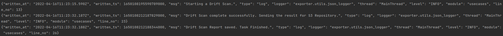

## Driftctl Exporter

[](https://codecov.io/gh/gcavalcante8808/driftctl-exporter)
[](https://github.com/gcavalcante8808/driftctl-exporter/actions)
[](https://github.com/gcavalcante8808/driftctl-exporter/actions)

This project aims export the driftctl scan result in the prometheus exporter/openmetrics format, making it suitable to monitoring possible drifts on an environment.

This project doesn't have a direct relation with [GitHub - snyk/driftctl: Detect, track and alert on infrastructure drift](https://github.com/snyk/driftctl), but it uses the scan feature and the result created by the drifctl tool to expose it as basic metrics and some other metrics (like counts by resource type).

#### How to use it

Before starting, you'll be going to need:

 * Docker (and optionally docker-compose) installed;
 * An AWS Credential capable to read almost all account resources. Usually this implies a set of permissions worthy of `ReadOnlyAccess`.

> The attachment of the `ReadOnlyAccess` policy in the Crential/IAM ROlE which will be used with driftctl (and driftctl-exporter) is the easiest way to sling the project up, but you may want to create a better/the least privileged policy and takes some other arguments in consideration like the ones present on the excellent `https://alestic.com/2015/10/aws-iam-readonly-too-permissive/` reading.

As the app uses two main scripts (scan.py and web.py) to create drift result and to expose it as metrics in the `/metrics` endpoint, the first thing is to run the scan.py itself:

```bash
docker run -it --rm gcavalcante8808/driftctl-exporter \
 -v $(pwd)/data:/data \
 -e DCTL_FROM="tfstate+s3://terraform-bucket/terraform.tfstate" \
 -e RESULT_PATH="file:///data/result.json" \
 -e AWS_REGION="us-east-1"\
 -e AWS_ACCESS_KEY_ID="SOME KEY" \
 -e AWS_SECRET_ACCESS_KEY="SOME SECRET" \
 python scan.py
```

During the scan.py execution, It's possible to check if the process went well by checking the logs:



After the scan.py conclusion, a driftctl result file should be present on `./data/result.json` (as specified in the `RESULT_PATH` environment variable) and thus it's possible to check the metrics by running the web.py:

```bash
docker run -it --rm gcavalcante8808/driftctl-exporter \
 -p 8080:8080 \
 -e DCTL_FROM="tfstate+s3://terraform-bucket/terraform.tfstate" \
 -e RESULT_PATH="file:///data/result.json" \
 -e AWS_REGION="us-east-1"\
 -e AWS_ACCESS_KEY_ID="SOME KEY" \
 -e AWS_SECRET_ACCESS_KEY="SOME SECRET" \
 python web.py
```

And accessing the URL: `http://localhost:8080/metrics`

#### Application Configuration

The application read its config mainly from following environment variables:

|                          | Description                                                                                                                                                                                                                                                                                                                           | Required | Default |
| ------------------------ | ------------------------------------------------------------------------------------------------------------------------------------------------------------------------------------------------------------------------------------------------------------------------------------------------------------------------------------- | -------- | ------- |
| DCTL_FROM                | Where driftctl can find the tfstate. Normally something like `tfstate:///home/user/terraform.tfstate`. The [Driftcl with terragrunt](https://driftctl.com/how-to-use-driftctl-with-terragrunt/) blog post have awesome examples on how to consume a tfstate from a s3 or a set of tfstates from terragrunt and other useful examples. | Yes      | N/A     |
| RESULT_PATH              | File or S3 URL Location where the scan result will be persisted by scan.py and read by web.py. Eg: s3://my-bucket/result.json, file:///data/result.json.                                                                                                                                                                                                               | **Yes**  | N/A     |
| AWS_S3_ENDPOINT_URL      | An optional endpoint for s3. Useful for those scenarios where you want to persist the scan results in a different region that scan ran or if you want to use non-aws s3 compatible implementations, like minio, ceph, digitalocean,etc. <br/>Eg: for local testing, I used "http://s3:9000" to point into the local minio.            | No*      | None    |
| AWS_S3_ACCESS_KEY_ID     | Access Key ID used to authenticate against the s3 endpoint configured. <br/>Required if you have configured the `AWS_S3_ENDPOINT_URL`                                                                                                                                                                                                 | No*      | None    |
| AWS_S3_SECRET_ACCESS_KEY | Secret ACCESS Key ID used to authenticate against the s3 endpoint configured.<br/>Required if you have configured the `AWS_S3_ENDPOINT_URL`                                                                                                                                                                                           | No*      | None    |

#### Supported Metrics

You can see a list with descriptions [here](docs/metrics.md).

#### Supported Storages

Besides the default example `file` storage usage (which persists drift result files in the local file system), its possible (and often recommended) to point RESULTS_PATH to a s3 bucket, making the application really stateless.

You can find more information about the results storage [here](docs/storage_support.md).

#### Helm and Kubernetes Support

The project is already packaged to use with Kubernetes using Helm. You can see some infos [here](docs/helm_kubernetes.md).

#### How It Really Works

There is some more details about the scan, web and workflow [here](docs/howitworks.md).

#### Docker WalkTrough

There is a docker-compose.yaml file used to develop/testing and that can be tweaked to run the project locally; more infos [here](docs/walktrough_docker.md).

### Other Considerations

Currently, the project only supports `file` and `s3` storages for driftctl results persistence/retrieve by its scripts. 

As the driftctl project itself advances in support other cloud environments like GCP and Azure, my plan is to add more storages like GCS and Azure Storage in the future.

### Author

Author: Gabriel Abdalla Cavalcante Silva (gabriel.cavalcante88@gmail.com)
