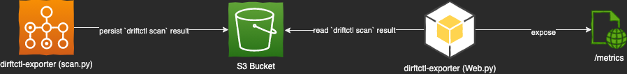

### Architecture - Components

The drifctl exporter consists in two main python scripts: **scan.py** and **web.py**, which compound the following workflow:

##### Scan.py

The **scan.py** script relies heavily on [GitHub - snyk/driftctl: Detect, track and alert on infrastructure drift](https://github.com/snyk/driftctl) to generate the drift result in json format.

As the `drifctl scan` can have some big execution times (depending on how many resources are you comparing), it is safe to assume the "batch" nature of the script; actually I think it should be executed some times in a day but not more often.

It executes the `driftctl scan` using the `DCTL_FROM` environment variable to read the `tfstate` file (or files) and compare the resources described in the tfstate with those created on the cloud; after that, it persist the `driftctl scan` json result in a s3 bucket specified by the `RESULT_PATH` environment variable.

##### Web.py

The **web.py** actually reads the drifctl scan result from the S3 specified on the  `RESULT_PATH` environment variables and expose the information in prometheus/openmetrics format at the `/metrics` endpoint.

> The web.py component expects that the s3 url defined in `RESULT_PATH` actually have the `driftctl scan` output in json format. If you don't have a result file yet, generate one by running the `scan.py` first.
