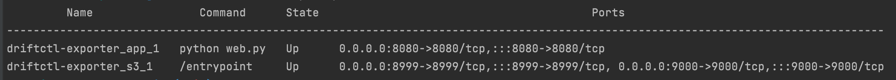
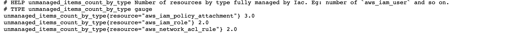

#### Walkthrough - AWS Scenario

Starting with a local spin of the project in mind,  where you cloned the project and accessed the created directory, this scenario steps requires the following:

* **AWS User Credentials/keys** capable to read all sort of resources on the target account. If unsure, check [AWS Iam Access Keys](https://docs.aws.amazon.com/IAM/latest/UserGuide/id_credentials_access-keys.html for more information) for more information;

* **Docker and docker-compose installed and working.**

Considering a scenario where you have an AWS account and credential, create a `.env` file in the root of the project with the following content (if unsure, check https://docs.aws.amazon.com/sdkref/latest/guide/environment-variables.html for more info):

```env
AWS_ACCESS_KEY_ID=<KEY HERE>
AWS_SECRET_ACCESS_KEY=<SECRET ACCESS KEY HERE>
AWS_SESSION_TOKEN=<IF YOURE USING SSO, YOU SHOULD PUT SOMETHING HERE>
AWS_REGION=<YOUR REGION>
```

> As the user credentials are used in this example, there is other ways like IAM Roles (preferred), profiles and so on; the project uses the default configuration for AWS SDK, so you can check https://docs.aws.amazon.com/cli/latest/userguide/cli-configure-envvars.html for more information about on how setup environment variables in other ways.

And execute the command `docker-compose up -d`. After a few seconds, check the status of the containers using the `docker-compose ps` command:



With the those two containers started, you can now run the `scan.py` script by calling the command `docker-compose exec app python scan.py`; after a few seconds (or more depending on how how much resources the target aws account have), check for `"msg": "Drift Scan Report saved. Task Finished"` log in the output:


Now point your browser to `http://localhost:8080/metrics` to see what metrics has been generated. Eg:



Enjoy!
